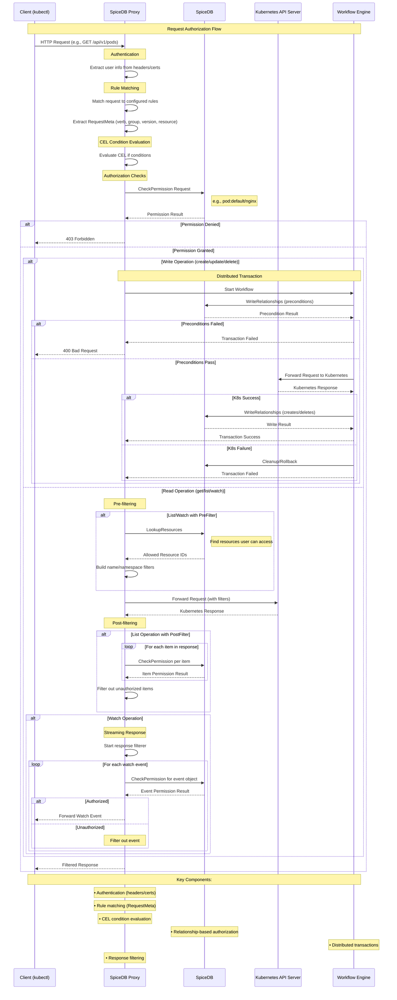

# SpiceDB Kubeapi Proxy Sequence Diagram

## Flow Explanation

1. **Authentication**: Extract user identity from request headers or certificates
2. **Rule Matching**: Find matching authorization rules based on API verb, group, version, and resource
3. **CEL Evaluation**: Apply conditional logic using CEL expressions if defined
4. **Authorization**: Check permissions in SpiceDB using relationship queries
5. **Transaction Handling**: For write operations, use distributed transactions to ensure consistency
6. **Filtering**: Apply pre-filters and post-filters to limit response data based on permissions
7. **Response**: Return filtered results to the client

## Rule Types

- **Check**: Verify user has permission (e.g., `pod:nginx#view@user:alice`)
- **PreFilter**: Limit query scope using SpiceDB lookups (for list/watch)
- **PostFilter**: Filter individual items in responses (for list operations)
- **Update**: Manage SpiceDB relationships during resource lifecycle